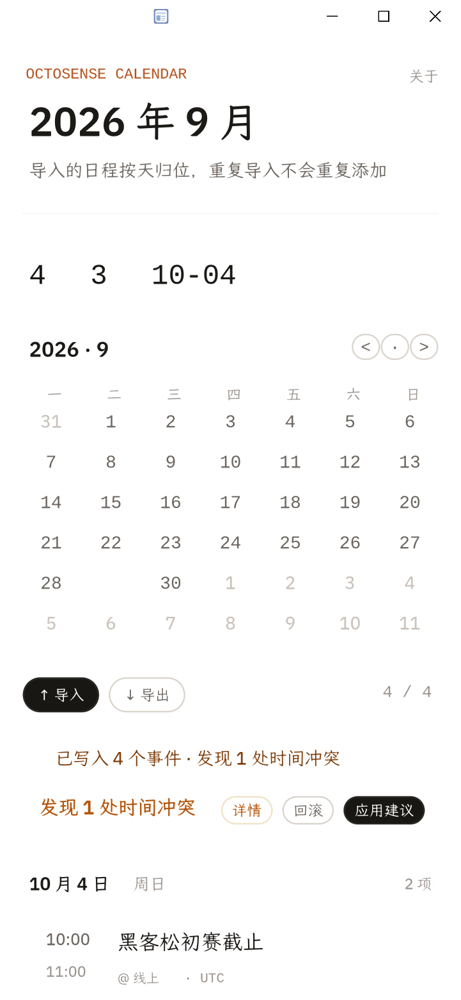

# OctoSense 日历

> **粘贴一段 ICS，看清冲突，改完无损导出。**

运行在 OctoSense 隔离宿主里的脚本应用（Splash 语言，`bundle/main.splash` 一个文件）。
没有账户、没有云同步、**没有网络权限**——日程不出这台设备。

| 主界面 | 冲突检出 | 冲突详情与建议 |
| --- | --- | --- |
|  |  |  |

---

## 目录

- [为什么做这件事](#为什么做这件事)
- [快速开始](#快速开始)
- [30 秒看懂它](#30-秒看懂它)
- [端到端实测（可复现）](#端到端实测可复现)
- [ICS 支持范围](#ics-支持范围)
- [冲突消解规则](#冲突消解规则)
- [数据来源与限制](#数据来源与限制)
- [权限与隐私](#权限与隐私)
- [演示脚本（2–3 分钟）](#演示脚本23-分钟)
- [目录结构](#目录结构)
- [排障](#排障)
- [许可与第三方](#许可与第三方)

---

## 为什么做这件事

日历导入导出这件小事，卡在两个地方：

1. **导入进来之后没法核对。** 别人的会议邀请、赛程表、课程表，多半以 ICS 文本（从网页或聊天里复制的一段
   `BEGIN:VCALENDAR…`）到你手上。粘进日历就完事，至于有没有和自己的安排撞车，没人告诉你。
2. **改完再导出，信息会悄悄丢。** 很多工具导出时把 `TZID=Asia/Shanghai` 丢掉、把全天事件的
   `VALUE=DATE` 降级成定时事件。文件看起来正常，读回去时间就偏了——而且不报错。

所以这个应用只做一件事，但把两端都做完整：**导入 → 检查冲突 → 给出可执行的改期建议 → 无损导出**。
判定标准是硬的：导出的文本再导入一次，必须报告「新增 0 / 改期 0 / 跳过 N」。

## 快速开始

### 0. 前置条件

| 需要 | 说明 |
| --- | --- |
| `card-host`（OctoSense 隔离宿主） | 从 **OctoSense-App-Hub** 构建 |
| Python 3.9+ | 只有实测脚本用得到，**无第三方依赖**；应用本身不需要 |
| `curl` | 实测脚本用来从宿主的远程控制桥取截图/快照 |

构建宿主（一次即可）：

```bash
git clone https://github.com/OctoSense-org/OctoSense-App-Hub
cd OctoSense-App-Hub
cargo build --release -p octosense-card-host -p octosense-app-hub
```

产出的 `card-host` 通常在 `<workspace>/OctoSense-App-Hub/target/release/`
或 `<workspace>/.cargo-target/octosense/release/`。本项目的实测脚本会在这几个位置自动找它；
找不到时用 `OCTO_CARD_HOST=<路径>` 指定。

### 1. 跑起来

**方式 A：用官方 `tools/octo`（推荐）**

```bash
cd <workspace>/OctoScript-App-Design-Flow
python3 tools/octo doctor                    # 先确认它找得到 card-host 与 hub
python3 tools/octo run <此仓库>/bundle --port 8141
python3 tools/octo shot 8141 out.png         # 另开一个终端截图
```

`octo doctor` 报 `[fail] card-host not found` 时，指向二进制再跑：

```bash
export OCTO_CARD_HOST=<workspace>/.cargo-target/octosense/release/card-host
export OCTO_HUB=<workspace>/.cargo-target/octosense/release/hub
```

**方式 B：直接启动宿主（Windows 上实测用的就是这条）**

```bash
cd <此仓库>
card-host --bundle bundle --app-data /tmp/octo-data --allow-unsigned --stamp
```

应用会直接显示出来。`--allow-unsigned` 是因为本地开发包没签名，属预期。

### 2. 走一遍准入检查

```bash
python3 <workspace>/OctoScript-App-Design-Flow/tools/octo check <此仓库>/bundle
```

本仓库当前输出：

```
com.oma.octosense.calendar 0.1.0 — PASSED
  [warning] publisher-signature: unsigned: accountability rests on the hub alone
  grants: capabilities {"storage"}, hosts {}, storage 16777216 bytes, agent none
```

`PASSED` 之后只剩「未签名」这一条警告——发布到 App Hub 需要由人用密钥签名，与代码本身无关。

## 30 秒看懂它

1. 点顶部 **导入**，把任意 ICS 文本粘进输入框，按 **解析**。
2. 面板底部出现 **预览 · N 个事件尚未写入**，按 **写入**。
3. 列表按日期分组显示事件；若与已有日程重叠，顶部出现 **发现 N 处时间冲突**。
4. 点 **详情**，看到具体是**哪两项**重叠、重叠**多久**、建议保留谁、把谁挪到哪个时段。
5. 点 **应用建议**，冲突归零；点 **回滚** 可撤销刚才这次写入。
6. 再点 **导入 → 导出**，输入框里就是完整的 ICS；全选复制即可贴回原来的日历。

## 端到端实测（可复现）

两条脚本都会在本地起一个隔离宿主，用宿主的远程控制桥（`/t` 输入、`/snap` 快照、`/g?raw=1` 截图）
逐步操作，**并在结束前检查宿主日志里的编译/运行错误数**。退出码非零即失败。

```bash
bash tools/run_e2e.sh        # ① 基本流程：空状态 → 导入 → 写入 → 列表
bash tools/run_conflict.sh   # ② 冲突 → 改期 → 导出 → 往返幂等 → 回滚 → 关于页
```

可用 `PY=` / `OCTO_CARD_HOST=` / `PORT=` 覆盖环境探测。

### ① 基本流程（`tools/run_e2e.sh`）

灌入 [`seed.ics`](seed.ics)（3 个事件：一个 UTC 定时、一个 `TZID=Asia/Shanghai` 带组织者的会、
一个 `VALUE=DATE` 全天）后，列表三组日期与星期全部正确，中文与 `Asia/Shanghai` 完整显示，
**编译/运行错误数 0**。

### ② 冲突流程（`tools/run_conflict.sh`）

灌入 [`conflict.ics`](conflict.ics)：一个 `10:30–11:30Z` 的「复赛宣讲会」，
故意撞上 `seed.ics` 里 `10:00–11:00Z` 的「黑客松初赛截止」。

| 步骤 | 实测结果 |
| --- | --- |
| 导入 `seed.ics` | 3 个事件 · 无冲突 |
| 导入 `conflict.ics` | 4 个事件 · **发现 1 处冲突** |
| 冲突详情 | **重叠 30 分钟** · 保留「黑客松初赛截止」 · 可动「复赛宣讲会（有约在前）」 |
| 应用建议 | **剩余 0 处冲突**，复赛宣讲会 `10:30 → 09:00`（紧贴前一个安排之后） |
| 导出 | 664 字节完整 ICS（4 个事件，含 `TZID` / `VALUE=DATE`） |
| **导出的文本原样再导入** | **新增 0 / 改期 0 / 跳过 4** |
| 回滚 | 已回滚到 4 个事件 |

倒数第二行是「导出不丢信息」的硬证据：如果 `TZID` 或 `Z` 后缀丢了，重新解析时事件会被判成新的，
「新增」就不会是 0。这条测试在本轮开发中确实抓出过两个会静默毁数据的缺陷（见下方提交历史）。

## ICS 支持范围

| 字段 / 特性 | 读入 | 导出 | 说明 |
| --- | --- | --- | --- |
| `VEVENT` / `VCALENDAR` | 是 | 是 | 多事件；`CRLF` 与折行按 RFC 5545 处理 |
| `DTSTART` / `DTEND`（UTC，`…Z`） | 是 | 是 | `Z` 后缀保留 |
| `DTSTART;TZID=…` | 是 | 是 | **带 `TZID` 参数原样写回**，不降级成浮动时间 |
| `DTSTART;VALUE=DATE`（全天） | 是 | 是 | `VALUE=DATE` 参数保留，且不参与自动改期 |
| `SUMMARY` / `LOCATION` | 是 | 是 | 文本转义（`\,` `\;` `\n`）双向处理 |
| `UID` / `SEQUENCE` | 是 | 是 | `UID` 用于判重；`SEQUENCE` 在列表里以 `# seq N` 显示 |
| `ORGANIZER` | 是 | 否 | 用于承诺权重判定（「有约在前」），导出时不重写 |
| `RRULE`（重复规则） | **否** | **否** | 见下方限制 |
| `VALARM` / `VTIMEZONE` | **否** | **否** | 不解析；`TZID` 作为不透明字符串保留 |

## 冲突消解规则

两条时间区间重叠即判为冲突，重叠时长按时长量化（例如「重叠 30 分钟」）。至于**该挪谁**，
不随机挑，而是算一个承诺权重：

| 判定 | 触发条件 | 建议 |
| --- | --- | --- |
| 硬承诺 | 标题含 `截止` / `提交` / `deadline` / `答辩` / `面试` / `考试` | **保留**，不动 |
| 有约在前 | 带 `ORGANIZER`（说明是别人约的、或已有参与方） | **移出**，并给出新时段 |
| 全天事件 | `VALUE=DATE` | 不参与自动改期（把一整天的承诺降成 1 小时会议属于语义破坏） |

新时段的选择逻辑是「紧贴冲突对象之前或之后，且不与其余事件重叠」——所以上例里
`10:30–11:30` 会落到 `09:00–10:00`，正好接在 `10:00` 的截止之前。

## 数据来源与限制

- **数据来源：只有你自己粘贴的文本。** 宿主没有给脚本应用文件选择器，
  `clipboard` 权限也尚无可用路径，所以**粘贴是唯一输入通道**——这是平台约束，不是设计偷懒。
  仓库里的 `seed.ics` 和 `conflict.ics` 是自造的测试数据，不含任何真实个人信息。
- **不做重复规则（`RRULE`）展开。** 遇到重复事件时只按第一个 `DTSTART` 处理，不会展开成多次。
  这也是本应用明确不做「完整日历客户端」的原因。
- **一切数据留在本机**，没有网络权限（详见 [PRIVACY.md](PRIVACY.md)）。
- **平台验证范围：目前只在 Windows 上实机验证。** 宿主本体是跨平台的，但本项目**没有**
  在 macOS / Linux / 移动端跑过，因此 `listing.json` 里只声明了 `windows`。
- **无账户与同步**：不登录、不跨设备同步、不订阅外部日历。

## 权限与隐私

`manifest.json` 只申请一项能力：

```json
{ "capabilities": ["storage"], "id": "com.oma.octosense.calendar", "name": "OctoSense 日历" }
```

`storage` = 宿主分配的本机私有存储（上限 16 MiB），宿主给用户展示的原话是：

> Keeps its own data on this device, in a space only it can read.
> Never contacts the network.

也就是：**应用在技术上无法把任何数据发出去**。无需「请相信我们」，权限清单就能证明。
完整说明见 [PRIVACY.md](PRIVACY.md)。

## 演示脚本（2–3 分钟）

对着这条讲，每步都对应一条可核对的输出：

| 时间 | 动作 | 说这句话 |
| --- | --- | --- |
| 0:00 | 显示空状态 | 「它不联网、不要账号。进来是空的，因为数据只可能来自你粘贴的文本。」 |
| 0:15 | 导入 → 粘贴 `seed.ics` → 解析 | 「解析出 3 个事件，注意它认出了三种时间写法：UTC、上海时区、和全天。」 |
| 0:35 | 写入 → 滚动列表 | 「三个日期分组、星期、时间、地点、时区全都对上了。」 |
| 0:55 | 再导入 → 粘贴 `conflict.ics` → 写入 | 「新会议撞了已有的截止时间——**发现 1 处冲突**，不是笼统一句『有冲突』。」 |
| 1:20 | 点详情 | 「重叠 30 分钟。它判断『截止』是硬承诺要保留、带组织者的会要挪走，并给出具体新时段。」 |
| 1:45 | 点应用建议 | 「一处点击，冲突归零。改错了还能回滚。」 |
| 2:00 | 点回滚 → 再导入 → 导出 | 「导出的是完整 ICS。」（把输入框里 `TZID=` / `VALUE=DATE` 指出来） |
| 2:20 | 关掉网络（可选） | 「断网也照样跑完——因为它本来就没有网络权限。」 |
| 2:30 | 收尾 | 「导出的文本原样再导入，结果是『新增 0 / 改期 0 / 跳过 4』——这是不丢信息的判据。」 |

## 目录结构

```
bundle/                 提交给宿主的应用包
  main.splash           全部界面与业务逻辑（单文件）
  manifest.json         权限声明与完整性戳
  listing.json          商店元数据（描述/分类/截图/发布者）
  assets/icon.svg       应用图标（档案卷宗配色）
  screenshots/          商店截图（实机截取，非设计稿渲染）
  octo-mascot-*.webp    吉祥物素材（随包分发，不走 CDN）
tools/                  开发与实测工具（不属于应用运行时）
  _env.sh               共用环境探测（python / card-host / 端口 / 代理）
  run_e2e.sh            ① 基本流程实测
  run_conflict.sh       ② 冲突·导出·往返·回滚实测
  e2e.py                远程控制桥驱动（输入/点击/读文本/截图）
  brace.py quotes.py deps.py   对 main.splash 的静态自检（括号/引号/前向引用）
seed.ics                基线测试数据（3 个事件，覆盖三种时间写法）
conflict.ics            冲突测试数据（与 seed 重叠 30 分钟）
docs/                   实测记录与调研笔记
```

应用本身**只依赖 `bundle/` 里的内容**：一份 `main.splash` 加静态素材，没有第三方运行时依赖。

## 排障

**截图和当前操作对不上 / 点击像没生效。** 先查代理：

```bash
env | grep -i proxy
```

如果设了 `http_proxy`，**发往 `127.0.0.1` 的请求也会被送进代理**，返回 502 或上一帧的旧截图，
症状极具误导性。实测脚本已在 `tools/_env.sh` 里设好 `NO_PROXY=127.0.0.1,localhost` 并让
`curl --noproxy`；手工调试时请照做，并给截图 URL 加一个随机参数破缓存
（`/g?raw=1&t=$RANDOM`）。

**`FATAL: 宿主未就绪`。** 看 `.runtime/run.log` 尾巴。常见原因是端口被占
（换 `PORT=8199`）或 `--bundle` 路径不对。

**界面文字被截断。** 宿主字体的宽度与浏览器差别很大（`font_code` ≈0.8 em、`font_regular` ≈0.9 em，
浏览器约 0.5 em），且每个 `Label` 另有约 7 px 水平开销。改文案或加字段后请重跑实测脚本确认。

## 许可与第三方

- 本项目源码以 **Apache License 2.0** 发布，见 [LICENSE](LICENSE)。
- 界面中的章鱼吉祥物来自 **Noto Animated Emoji** 的 `:octopus:`（U+1F419），
  按 **CC BY 4.0** 使用，署名与应用内「关于」页见 [THIRD-PARTY.md](THIRD-PARTY.md)。
- 应用仅在「关于」页展示该素材以声明出处，**不做商业使用、不再分发素材库本身**。

---

## 参赛信息

**2026 GOSIM Agentic App Hackathon · 赛道：应用**

| 项 | 内容 |
| --- | --- |
| 队伍 | **OMA** |
| 成员 | `mark-liuzh`、`ody-cai` |
| 应用 ID | `com.oma.octosense.calendar` |
| 版本 | `0.1.0` |
| 形态 | OctoSense 脚本应用（Splash），单 `main.splash` + 静态素材 |
| 准入检查 | `octo check` → `com.oma.octosense.calendar 0.1.0 — PASSED`（仅余未签名警告） |
