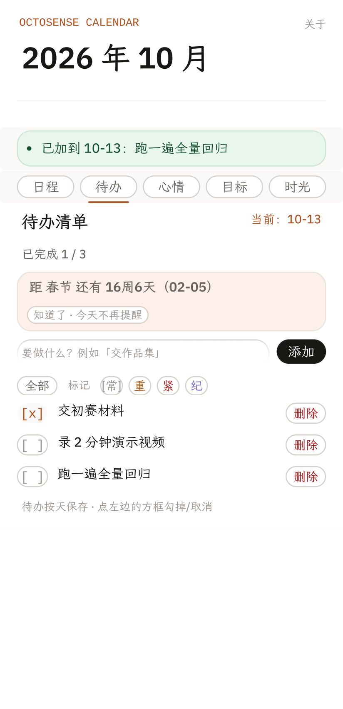

# OctoSense 日历

> **在月历上点一天直接写日程（生日可设每年重复）；粘贴一段 ICS，看清冲突，改完无损导出。**

运行在 OctoSense 隔离宿主里的脚本应用（Splash 语言，`bundle/main.splash` 一个文件）。
没有账户、没有云同步。申请 `storage`（本机存储）+ `net`（**仅 Open-Meteo 天气一项只读 GET**，不传任何用户数据）+ `model`（一次性的模型调用，用于给冲突改期建议）——日程、待办、心情、目标、时间胶囊等**用户数据**不出这台设备。

| 主界面 | 点格子写日程 | ICS 导入 | 冲突详情与建议 |
| --- | --- | --- | --- |
|  |  |  |  |

---

## 目录

- [为什么做这件事](#为什么做这件事)
- [快速开始](#快速开始)
- [30 秒看懂它](#30-秒看懂它)
- [另外六个分区（2026-10-01 新增）](#另外六个分区2026-10-01-新增)
- [端到端实测（可复现）](#端到端实测可复现)
- [ICS 支持范围](#ics-支持范围)
- [冲突消解规则](#冲突消解规则)
- [数据来源与限制](#数据来源与限制)
- [权限与隐私](#权限与隐私)
- [演示视频](#演示视频)
- [演示脚本（2–3 分钟）](#演示脚本23-分钟)
- [目录结构](#目录结构)
- [排障](#排障)
- [许可与第三方](#许可与第三方)

---

## 为什么做这件事

日历导入导出这件小事，卡在两个地方：

1. **导入进来之后没法核对。** 别人的会议邀请、赛程表、课程表，多半以 ICS 文本（从网页或聊天里复制的一段
   `BEGIN:VCALENDAR…`）到你手上。粘进日历就完事，至于有没有和自己的安排撞车，没人告诉你。
2. **改完再导出，信息会悄悄丢。** 很多工具导出时把 `TZID=Asia/Shanghai` 丢掉、把全天事件的
   `VALUE=DATE` 降级成定时事件。文件看起来正常，读回去时间就偏了——而且不报错。

所以这个应用只做一件事，但把两端都做完整：**导入 → 检查冲突 → 给出可执行的改期建议 → 无损导出**。
判定标准是硬的：导出的文本再导入一次，必须报告「新增 0 / 改期 0 / 跳过 N」。

## 快速开始

### 0. 前置条件

| 需要 | 说明 |
| --- | --- |
| `card-host`（OctoSense 隔离宿主） | 从 **OctoSense-App-Hub** 构建 |
| Python 3.9+ | 只有实测脚本用得到，**无第三方依赖**；应用本身不需要 |
| `curl` | 实测脚本用来从宿主的远程控制桥取截图/快照 |

构建宿主（一次即可）：

```bash
git clone https://github.com/OctoSense-org/OctoSense-App-Hub
cd OctoSense-App-Hub
cargo build --release -p octosense-card-host -p octosense-app-hub
```

产出的 `card-host` 通常在 `<workspace>/OctoSense-App-Hub/target/release/`
或 `<workspace>/.cargo-target/octosense/release/`。本项目的实测脚本会在这几个位置自动找它；
找不到时用 `OCTO_CARD_HOST=<路径>` 指定。

### 1. 跑起来

> ⚠️ **先跑完下面「2. 走一遍准入检查」再执行本节**——准入检查验证的是 clone 里的**原始字节**，
> 本节的步骤会修改工作区里的 `bundle/manifest.json`（剥掉签名字段），跑完用
> `git checkout -- bundle/manifest.json` 恢复。

本仓库的 `bundle/` 是**已签名发布件**（OMA 密钥签名）。而 `card-host` 不验证任何 publisher 公钥，
对带签名的 manifest 会直接拒绝（`refused: no signature verifier is installed`）——`--allow-unsigned`
只对**无**签名的 manifest 生效，官方 harness 的 `octo run` 内部同样以 `--allow-unsigned` 调
card-host（两种方式都已实测确认）。本地查看 UI 需要先剥掉 signature 字段：

```bash
cd <此仓库>
python3 -c "import json;p='bundle/manifest.json';m=json.load(open(p));del m['integrity']['signature'];json.dump(m,open(p,'w'),indent=2,ensure_ascii=False)"
```

**方式 A：用官方 `tools/octo`（推荐）**

```bash
cd <workspace>/OctoScript-App-Design-Flow
python3 tools/octo doctor                    # 先确认它找得到 card-host 与 hub
python3 tools/octo run <此仓库>/bundle --port 8141
python3 tools/octo shot 8141 out.png         # 另开一个终端截图
```

`octo doctor` 报 `[fail] card-host not found` 时，指向二进制再跑：

```bash
export OCTO_CARD_HOST=<workspace>/.cargo-target/octosense/release/card-host
export OCTO_HUB=<workspace>/.cargo-target/octosense/release/hub
```

**方式 B：直接启动宿主（Windows 上实测用的就是这条）**

```bash
cd <此仓库>
card-host --bundle bundle --app-data /tmp/octo-data --allow-unsigned --stamp
```

应用会直接显示出来。

### 2. 走一遍准入检查

```bash
python3 <workspace>/OctoScript-App-Design-Flow/tools/octo check <此仓库>/bundle
```

发布基准 **`7e6fd1ac5bda1493d43f4cb52ce734dfc219d46b`**（tag `v0.5.0`；2026-10-10）。
这一份 bundle 在**本仓库 `bundle/`、GitHub 该 commit、Release `v0.5.0`（id 408621775）下载件解包三处逐字节一致**，
manifest 声明的 digest 是 `05c9de8b…` / signature `b6412507…`（key_id `OMA`）。

本机（ody-cai Mac）复现：

```bash
_toolchain/OctoSense-App-Hub/target/release/hub check bundle \
  --publisher-key OMA=46b11cc186e7a8ea8688c9d5a246caeaa27e6e0c8ba2986547d7511c0b872380
# → com.oma.octosense.calendar 0.5.0 — PASSED
#   grants: capabilities {"model", "net", "storage"}, hosts {"api.open-meteo.com"}
```

> ⚠️ **本机 hub 必须带 `--publisher-key`**：不带时会报
> `publisher key "OMA" is not registered with this hub`，这是本机没装公钥造成的，不是 bundle 问题。
>
> ⚠️ **不要在本机显式跑 `hub stamp` 去「重算」digest**：当前 `05c9de8b…` 已与远端发布件一致，
> 再 stamp 会让本仓库与已发布件分叉。
> （`octo check` 对已签名 manifest 会拒绝重戳，不会自动改。）
> 复核发布件请以 GitHub `7e6fd1a` / Release `v0.5.0` 为准。

历史背景见下方「参赛信息」与 [`docs/RELEASE-NOTES-v0.5.0.md`](docs/RELEASE-NOTES-v0.5.0.md)；
初赛版本（v0.4.1）的三次重发布考据见 [`docs/RELEASE-NOTES-v0.4.1.md`](docs/RELEASE-NOTES-v0.4.1.md)「⚠️ 准入检查」一节。

## 30 秒看懂它

1. **不用 ICS 也能用**：点月历上任意一格 → 下方展开「新建日程 · 写在这一天」，日期已自动预填；
   写下标题（例如「妈妈生日」），按 **重复** 按钮在 `不重复 → 每天 → 每周 → 每月 → 每年` 之间循环，
   切到 **每年** 后按 **保存**。点中的那格会留一层赤陶色底纹，告诉你「写的就是这天」；
   保存后月历上出现事件点，**次年同期也会出现**（重复规则真的展开了）。
   想改日期就点别的格子 —— 已经敲进去的标题和重复档位**不会被清掉**；翻月则连选中态一起收起。
2. 点顶部 **导入**，把任意 ICS 文本粘进输入框，按 **解析**。
3. 面板底部出现 **预览 · N 个事件尚未写入**，按 **写入**。
4. 列表按日期分组显示事件；若与已有日程重叠，顶部出现 **发现 N 处时间冲突**。
5. 点 **详情**，看到具体是**哪两项**重叠、重叠**多久**、建议保留谁、把谁挪到哪个时段。
6. 点 **应用建议**，冲突归零；点 **回滚** 可撤销刚才这次写入。
7. 再点 **导入 → 导出**，输入框里就是完整的 ICS；全选复制即可贴回原来的日历。
   手工建的日程与导入的事件走同一套合并逻辑，所以它一样能被无损导出带走。
8. 月历下方点 **节日 中国 / 节日 国际 / 节日 全部** 循环切换节日来源，日历格子的标记跟着变：
   **放假 = 小绿点 + 绿色节日名**（**放假的每一天**都写出来，例如国庆 7 天每一格都标「国庆」）、
   **节日但照常上班 = 深灰小黑点**、**调休补班 = 一格「班」字**；
   下方说明行写出「当月节日」与「放假 N 天 · M/D 上班」。日期格子之间用分隔线隔开。
9. 顶部有 **日程 / 待办 / 心情 / 目标 / 彩蛋** 五个分区 —— 见下一节。

---

## 另外六个分区（2026-10-01 新增）

| 待办清单 | 目标与子任务 | 小知识彩蛋 |
| --- | --- | --- |
|  |  |  |

它们都遵守同一条铁律：**本地优先**。每个分区写自己的一个 json 文件，
日程 / 待办 / 心情 / 目标 / 时间胶囊全在应用私有目录里，没有任何网络请求。
`manifest.json` 申请 `storage`（本机存储）+ `net`（**仅 Open-Meteo 天气一项只读 GET**，不传任何用户数据）。

| 分区 | 做什么 | 落在哪 |
| --- | --- | --- |
| **待办清单** | 按「天」记待办；点左边方框勾掉／取消；可在「全部 / 只看未完成」之间过滤；单条可删 | `todos.json` |
| **情绪日记** | 5 档心情（开心 / 平静 / 一般 / 疲惫 / 低落）+ 一句备注；月历下方显示「本月已记 N 天」 | `moods.json` |
| **目标与子任务** | 3 张中长期目标卡（AP 考试、旅行计划…），每张可拆最多 3 个阶段性小任务；用纯 ASCII 进度条显示 `1/2 步` | `goals.json` |
| **事件图** | 不另开图表区（会占掉竖向预算），而是把「图」放回日历本身：**月视图每格底色 = 那天的事件数**（越深越多），**周视图 7 行摘要**，**日视图**列出当天日程 | 读事件库 |
| **小知识 / 彩蛋** | 节气（2025–2030 按 Meeus 算法**实算**）、历史上的今天、天文与科学小知识 | 源码内置表 |
| **时间胶囊** | 写一句话封存到某个解封日，**到期前只显示「封存中」**，到期后才能点「开启」看到当时写的内容 | `capsules.json` |

**共享日历的边界（写在界面上，不只是写在 README 里）**：真正的**实时互通**需要一个后端，
而本应用**用户数据**没有任何网络出口（`net` 仅给 Open-Meteo 天气一项只读 GET，不传任何用户数据），
所以做不了「你改了我这边立刻变」。
「关于页」里给的是这件事的**最大诚实版本** —— **共享范围控制**：
把愿意分享的事件标出来（全部共享 / 取消共享），导出时**只带这些**，
私密事件连包都不进。这样交换仍然可以走用户自己的渠道（把共享包发给对方），
而权限边界由标记本身决定。界面上直说了这一点，不假装有服务器。

**吉祥物**：首页有一只章鱼（Noto Animated Emoji，48 帧 WebP，CC BY 4.0）。
点它会换一句话（9 句轮换，其中一句就是「导入的日程会按天归位，重复导入不会重复添加」）。
它不是装饰性的贴纸 —— 是这个应用唯一会「回应」你的东西，也是唯一不用翻文档就能读到的用法提示。

## 端到端实测（可复现）

八条脚本都会在本地起一个隔离宿主，用宿主的远程控制桥（`/k` 输入、`/snap` 快照、`/g?raw=1` 截图）
逐步操作，**并在结束前检查宿主日志里的编译/运行错误数**。退出码非零即失败。

每一条在起宿主之前都会先跑**静态门禁**（`brace` / `quotes` / `toplevel` / `deps` / `paintfix` /
`btnfocus` / `cellhover` / `fncalls`），不过就直接退出——免得带着语法或规则错误去跑十分钟的界面流程。

```bash
bash tools/run_all.sh        # 一键：静态自检 + 下面八条流程（串行，推荐）
bash tools/run_all.sh --fast # 只跑静态自检，秒级

bash tools/run_e2e.sh        # ① 基本流程：空状态 → 导入 → 写入 → 列表
bash tools/run_conflict.sh   # ② 冲突 → 改期 → 导出 → 往返幂等 → 回滚 → 关于页
bash tools/run_edge.sh       # ③ 边界字段（RRULE / EXDATE / RDATE / 转义 / 折行）与往返
bash tools/run_negative.sh   # ④ 异常输入：空输入 / 非 ICS / 空日历 / 残缺事件 / 不存在的日期
bash tools/run_festival.sh   # ⑤ 节假日标注 + 节日来源切换（含像素级颜色断言）
bash tools/run_layout.sh     # ⑥ 逐页布局几何（12 个界面状态，查零尺寸/越界控件）
bash tools/run_new.sh        # ⑦ 点格子写日程 / 重复规则 / 选中高亮 / 往返
bash tools/run_features.sh   # ⑧ 待办 / 心情 / 目标 / 彩蛋 / 日周月视图 / 吉祥物 / 胶囊
                             #    （语义断言 + 本地优先落盘与读回 + 9 个新界面几何扫描）
```

①–⑤、⑦、⑧ 查的是**功能对不对**（状态文本、像素颜色、往返幂等、与源码数据表交叉校验）；
⑥ 与 ⑧ 的第 [5] 步查的是**界面有没有坏掉**：把应用走到各个界面状态，每步对 `/snap` 快照做
几何检查（零尺寸 / 负坐标 / 右侧越界）。像素断言只覆盖「特意去取色的那几个点」，一个被压成
0 高的 Label 或跑到窗口右边的按钮不会让任何断言失败 —— 这道几何防线就是为它们准备的。
⑥ 覆盖**日程侧**（导入/冲突/导出/关于），⑧ 覆盖**新分区侧**（待办/心情/目标/彩蛋/日周视图）。

⑦ 是**唯一**以「不用 ICS、直接在界面上写日程」为入口的流程。它单独立项的原因：这条路径
（点格子 `pick_cell` → 新建面板 `save_new` → 落库 → 画布重绘）**没有 ICS 解析器兜底**，
前面六条一条都覆盖不到。它同时验证了「每年重复真的展开到次年」——用的是截图回读的事件点
像素，而不是「状态行说它是每年」这种自证式断言。

⑧ 覆盖 2026-10-01 新增的六个分区。它有一条别处都没有的断言方式：**与 `main.splash` 里的
数据表交叉校验**（把 `HISTORY` / `SOLAR_TERMS` 从源码里读回来，逐字比对界面上的字），
以及**本地优先的进程级证据**（杀掉宿主、换一个进程重新起、再读一次磁盘上的数据）。

可用 `PY=` / `OCTO_CARD_HOST=` / `PORT=` 覆盖环境探测。

**为什么推荐 `run_all.sh` 而不是自己写个 `for` 循环串起来**：这些流程共用同一个宿主进程
与远程控制端口，串行跑法的正确性完全押在「每条结束时宿主真的退了」上。一旦某条漏了收工，
失败会**出现在下一条**（端口被占 / 存储清不掉），报错信息与真正的原因隔了一层，排查成本极高
（本项目就因此误伤过一次，根因是 `run_festival.sh` 漏了收工）。`run_all.sh` 因此显式做了三件事：

1. 每条流程开跑前，确认端口 \($PORT\) 是空的——宿主的「就绪探测」只看端口有没有响应，
   若僵尸宿主还活着，新宿主绑不上端口，**探测却会打到僵尸身上**，那一条流程全程都在测别人的进程；
2. 每条流程结束后，无论它自己有没有收好，再兜底 `kill_host` 并校验端口已释放；
3. 存储**每轮换一个全新目录**（`app-data-<时间戳>-<pid>`，旧的尽力删）。
   不依赖「能否删掉上一轮的目录」——Windows 上进程刚杀、句柄未释放时 `rm -rf` 会**静默失败**，
   下一轮就带着上一轮的数据开跑，而布局树断言全过（数据是异步 `load()` 进来的），只有像素断言对不上。

每条流程各自的完整日志落在 `.runtime/run-all/<脚本名>.txt`，终端只摊出关键几行。

### ① 基本流程（`tools/run_e2e.sh`）

灌入 [`seed.ics`](seed.ics)（3 个事件：一个 UTC 定时、一个 `TZID=Asia/Shanghai` 带组织者的会、
一个 `VALUE=DATE` 全天）后，列表三组日期与星期全部正确，中文与 `Asia/Shanghai` 完整显示，
**编译/运行错误数 0**。

### ② 冲突流程（`tools/run_conflict.sh`）

灌入 [`conflict.ics`](conflict.ics)：一个 `10:30–11:30Z` 的「复赛宣讲会」，
故意撞上 `seed.ics` 里 `10:00–11:00Z` 的「黑客松初赛截止」。

| 步骤 | 实测结果 |
| --- | --- |
| 导入 `seed.ics` | 3 个事件 · 无冲突 |
| 导入 `conflict.ics` | 4 个事件 · **发现 1 处冲突** |
| 冲突详情 | **重叠 30 分钟** · 保留「黑客松初赛截止」 · 可动「复赛宣讲会（有约在前）」 |
| 应用建议 | **剩余 0 处冲突**，复赛宣讲会 `10:30 → 09:00`（紧贴前一个安排之后） |
| 导出 | 664 字节完整 ICS（4 个事件，含 `TZID` / `VALUE=DATE`） |
| **导出的文本原样再导入** | **新增 0 / 改期 0 / 跳过 4** |
| 回滚 | 已回滚到 4 个事件 |

倒数第二行是「导出不丢信息」的硬证据：如果 `TZID` 或 `Z` 后缀丢了，重新解析时事件会被判成新的，
「新增」就不会是 0。这条测试在本轮开发中确实抓出过两个会静默毁数据的缺陷（见下方提交历史）。

### ⑤ 节假日与节日来源（`tools/run_festival.sh`）

`/snap` 快照**只有 `i / ty / r / w`，不带颜色**，所以「绿点 = 放假、深灰点 = 照常上班、
赤陶字 = 调休」这三条语义**必须回读截图像素**才能验证。脚本会用 `tools/e2e.py dotcolor`
在截图里逐个标记点取 5×5 邻域投票定性，断言序列。

格子里除了点，**放假的每一天还会用绿色小字写出节日名**（国庆 7 天每一格都标「国庆」）——
光有绿点只能说明「这天放假」，说不出「放的什么假」。格子之间用 1px 分隔线隔开，
让「这一格是哪一天」不再糊成一片（做法是让容器的线色从格子间隙里露出来，不是逐格画 border）。
节日名超过 3 个字时取前 2 字：2025-10 的「国庆中秋」有 4 字，@9px 约 49px，
加上绿点与间距会超出格子内容宽（≈52px），实测被裁成「国庆中秂」。

⚠️ **格子里有三种同尺寸（3.5px）的小圆点**，快照里长得一模一样，只有回读像素才能分：
**放假绿点**（法定放假）、**深灰点**（节日但照常上班，如九一八 / 万圣节 / 长征）、
**赤陶点**（当天有日程）。所以「这个月有几个点」= 放假天数 **+** 节日上班天数
（+ 有日程的天数）。下表的期望值按这个恒等式推导，不是只数绿点。

| 步骤 | 期望 | 结果 |
| --- | --- | --- |
| 2026-09（中国） | 中秋 3 天放假 + 9/3 抗战、9/18 九一八 照常上班 + 9/20「班」字 | `WORK,WORK,OK,OK,OK` · `EVENT` |
| 2026-10（中国） | 国庆 7 天放假 + 10/22 长征 照常上班 + 10/10「班」字 | `OK×7,WORK` · `EVENT` |
| 2026-10（仅国际） | 国内标记全部消失，只剩万圣节**深灰点** | `WORK` · 无「班」字 |
| 2026-10（全部） | 7 绿 + 2 深灰（长征 + 万圣节）并集 | `OK×7,WORK,WORK` · `EVENT` |
| 2025-10（中国） | 国庆中秋 8 天 + 10/22 长征 照常上班 + 10/11 补班 | `OK×8,WORK` · `EVENT` |
| 2025-09（中国） | 无放假；9/3 抗战、9/18 九一八 照常上班 + 9/28「班」字 | `WORK,WORK` · `EVENT` |

> 为什么取色要「投票」而不是取中心像素：3.5px 的圆点在当前 DPI 下只有约 6px，
> 边缘一圈全是抗锯齿过渡色；而放假绿 `#15803d` 与照常上班灰 `#6b6560` 的**亮度几乎相同**
> （≈100 / ≈102），取中位色或「最深像素」都判不准。

> 「班」字的像素判定曾在 2026-10 出现过「失败、9 月通过」的记录，
> 怀疑采样窗口蹭到邻近的天气图标。**2026-10-08 未能复现**：
> 4 处「班」字判定全绿，且把窗口高度换回 412x892 跑同一份代码结果不变 ——
> 与窗口高度无关，也没有证据支持「蹭到天气图标」这个推测。
> 因此**没有改判定器**（`dot_kinds` 的 5×5 邻域保持原样）；
> 若将来真复现，先 dump 该月格子的原始矩形与 BANXY 再定位，不要先改期望值。

## ICS 支持范围

| 字段 / 特性 | 读入 | 导出 | 说明 |
| --- | --- | --- | --- |
| `VEVENT` / `VCALENDAR` | 是 | 是 | 多事件；`CRLF` 与折行按 RFC 5545 处理 |
| `DTSTART` / `DTEND`（UTC，`…Z`） | 是 | 是 | `Z` 后缀保留 |
| `DTSTART;TZID=…` | 是 | 是 | **带 `TZID` 参数原样写回**，不降级成浮动时间 |
| `DTSTART;VALUE=DATE`（全天） | 是 | 是 | `VALUE=DATE` 参数保留，且不参与自动改期 |
| `SUMMARY` / `LOCATION` | 是 | 是 | 文本转义（`\,` `\;` `\n`）双向处理 |
| `UID` / `SEQUENCE` | 是 | 是 | `UID` 用于判重；`SEQUENCE` 在列表里以 `# seq N` 显示 |
| `ORGANIZER` | 是 | 否 | 用于承诺权重判定（「有约在前」），导出时不重写 |
| `RRULE`（重复规则） | 原样保留 | 原样写回 | **导入的不展开**；界面上手写的四档会展开 —— 见下方限制 |
| `VALARM` / `VTIMEZONE` | **否** | **否** | 不解析；`TZID` 作为不透明字符串保留 |

## 冲突消解规则

两条时间区间重叠即判为冲突，重叠时长按时长量化（例如「重叠 30 分钟」）。至于**该挪谁**，
不随机挑，而是算一个承诺权重：

| 判定 | 触发条件 | 建议 |
| --- | --- | --- |
| 硬承诺 | 标题含 `截止` / `提交` / `deadline` / `答辩` / `面试` / `考试` | **保留**，不动 |
| 有约在前 | 带 `ORGANIZER`（说明是别人约的、或已有参与方） | **移出**，并给出新时段 |
| 全天事件 | `VALUE=DATE` | 不参与自动改期（把一整天的承诺降成 1 小时会议属于语义破坏） |

新时段的选择逻辑是「紧贴冲突对象之前或之后，且不与其余事件重叠」——所以上例里
`10:30–11:30` 会落到 `09:00–10:00`，正好接在 `10:00` 的截止之前。

## 数据来源与限制

- **数据来源：只有你自己粘贴的文本。** 宿主没有给脚本应用文件选择器，
  `clipboard` 权限也尚无可用路径，所以**粘贴是唯一输入通道**——这是平台约束，不是设计偷懒。
  仓库里的 `seed.ics` 和 `conflict.ics` 是自造的测试数据，不含任何真实个人信息。
- **节假日数据是内置常量，随版本冻结。** 节假日 / 节气 / 历史上的今天等日历相关模块**无网络权限**，
  因此法定节假日**只能内置**，不能联网拉取（`net` 仅给 Open-Meteo 天气一项用）。当前内置 **2025 与 2026** 两个年度，
  依据国务院办公厅发布的《关于 20XX 年部分节假日安排的通知》整理：
  放假区间、调休补班的日期都按官方安排写入 `bundle/main.splash` 的 `HOLIDAYS` /
  `WORKDAYS` / `CN_SPANS` 三个常量。**2027 年及以后不会自动出现**——这是刻意的取舍：
  宁可明确「没有数据」，也不要猜错让人误了上班。
  国际节日只收录**固定日期**的常见节日（元旦 / 情人节 / 妇女节 / 愚人节 / 劳动节 /
  儿童节 / 万圣节 / 平安夜 / 圣诞节），**不收录复活节、感恩节这类浮动节日**（需要天文算法）。
  国际节日只作提示，**不标注放假**——各国外汇/工作日规则不同，标错比不标更糟。
- **节气数据是算出来的，不是抄来的。** 同样是内置常量（没有网络权限），但它不是从某张表上
  誊写的：`SOLAR_TERMS` 覆盖 **2025–2030 六年共 144 个节气**，由
  `docs/` 下的一次性脚本按 **Meeus 天文算法**实算（太阳视黄经每 15° 一个节气）后固化成常量。
  为什么要自己算：**通用的「寿星公式」在 2026 年雨水上会差一天**（实测），
  这类「差一天」的错误在界面上和正确值长得一模一样，只能靠算法对算法才发现。
  六年之外没有数据，界面会退回近似公式并**带上「≈」前缀**，让人一眼看出这不是算出来的。
- **「历史上的今天」是选编，不是全集。** 内置 **75 条**，取向偏科学 / 技术 / 探索 / 文化，
  刻意避开政治与争议性事件。没有收录的那一天，界面写的是
  「这一天暂时没有收录（选编条目有限，不是全集）」——把边界写在界面上，而不是留白让人误以为坏了。
- **时间胶囊不做加密。** 它只是本地一条 `capsules.json` 记录，到期前界面不显示正文
  （显示「封存中 · M/D 解封」）。**它不是安全机制** —— 同机同权限下打开那个 json 就能看到内容，
  界面上也这么写。把它当「给自己一个仪式感」，不要当密码箱。
- **共享日历没有实时互通（能力边界，不是偷懒）。** 真正的多人同步需要一个后端，
  而本应用**用户数据**没有任何网络出口（`net` 仅给 Open-Meteo 天气一项只读 GET，不传任何用户数据），
  所以技术上做不到。
  「关于页」给的是这件事的最大诚实版本 —— **共享范围控制**：标记哪些事件愿意分享，
  导出共享包时**只带这些**，私密事件连包都不进。交换本身走用户自己的渠道（把包发给对方），
  权限边界由标记决定。这一段**直接写在应用界面上**，不指望用户回来读 README。
- **重复规则（`RRULE`）分两条通道，口径不一样，必须分开说：**
  - **导入通道（不展开）**：粘进来的 `RRULE` 只按第一个 `DTSTART` 处理，列表里一个「每周例会」
    只显示一行。`RRULE` 连同 `EXDATE` / `RDATE` 会**原样保留、原样写回导出**，不会静默丢字段。
  - **界面通道（展开）**：用「点格子 → 重复 → 保存」建出来的日程，`每天 / 每周 / 每月 / 每年`
    四档会真的展开，在对应日期的格子上显示事件点（每年重复的事件，次年同期也会出现）。
  - **界面通道只展开"朴素"规则。** 判定是轻量命中：按年 / 月 / 周 / 日的步长比对起始日。
    带任何修饰的规则（`INTERVAL` / `BYDAY` / `BYSETPOS` / `COUNT` / `UNTIL` …）**一律不展开**，
    只保留 `DTSTART` 当天一个点 —— 例如 `FREQ=WEEKLY;INTERVAL=2`（隔周）与
    `FREQ=MONTHLY;BYDAY=-1FR`（每月最后一个周五）都在此列。
    这是刻意的取舍：**宁可少标，不可乱标**（把隔周标成每周、把月末周五标成"和起始日同号"，
    比不标有害得多）。落地方式是一张白名单 `rrule_plain()`，回归见 `tools/rrule_guard.py`。
  - **已知的边界**：`FREQ=YEARLY` 起始于 2 月 29 日时，平年没有这一天，那一年就整年不出现
    （按 RFC 5545，无效日期直接跳过，不是顺延到 3 月 1 日）；`FREQ=MONTHLY` 起始于 31 日时，
    只有 31 天的月份才有标记。界面不会为这两种情况额外提醒。
- **用户数据留在本机**；`manifest.json` 申请 `storage`（本机存储）+ `net`（仅 Open-Meteo 天气一项只读 GET，不传任何用户数据）（详见 [PRIVACY.md](PRIVACY.md)）。
- **平台验证范围：Windows、macOS 与 Linux 均已实机验证；移动端仍未验证。**
  - **Windows**（初版开发者）与 **macOS**（2026-10-01 补齐）：跑通 8 道静态门禁与全部 8 条
    端到端流程，因此 `listing.json` 声明 `windows` + `macos`。
  - **Linux**（Ubuntu 24.04.5 LTS，2026-10-04 补齐）：`run_e2e.sh` 10/10 全绿，
    `run_conflict.sh` 17/21。**剩下4 条红不是应用缺陷，是夹具限制** ——
    断言只扫视口内文本（`/snap` 只返回视口内控件），而目标在视口外；
    同一份 bundle 在 v0.4.0 上跑出**完全相同的 4 条红**，与 Linux 无关。
    详细归因见 `docs/regression-status-2026-10-04.md`。
  - ⚠️ **Linux 复现前提**：须在 `Xvfb :99 -screen 0 1400x1050x24` 下运行。
    窗口默认 1400x1050 时，导入面板会被挤出视口，连「导入」按钮都点不到
    （症状与 P0-3 完全不同，别混为一谈）。
  - （macOS 侧补齐过程中修掉的三处「测试写死的隐含假设」：月份绝对定位、输入框清空、
    按钮掉出视口 —— 详见 `tools/` 内相应脚本的注释。）
  - **移动端**（iOS / Android）宿主尚未提供，故完全未验证，不在声明之列。
- **无账户与同步**：不登录、不跨设备同步、不订阅外部日历。

## 权限与隐私

**先说本应用自己做了什么，再引用宿主的原话** —— 顺序反过来读起来像在回避：

本应用申请 `storage`（本机存储）、`net`（**仅 Open-Meteo 天气一项只读 GET**，
1 个 host）、`model`（一次性的模型调用，用于冲突消解建议）：

```json
{
  "capabilities": ["storage", "net", "model"],
  "network": {
    "hosts": [
      "api.open-meteo.com"
    ]
  },
  "id": "com.oma.octosense.calendar",
  "name": "OctoSense 日历"
}
```

逐项说清每一种能力用在哪、发出什么、什么时候发：

| 能力 | 用在哪 | 发出什么 | 什么时候 |
| --- | --- | --- | --- |
| `storage` | 事件库、天气缓存、导入快照 | **不发出任何东西** | 全程只在本机 |
| `net` | 月历格子的天气（`sys.weather` 逐日取数，冷启动一次后缓存本机） | 仅经纬度与日期，**不带任何事件字段** | 冷启动一次；断网回落上次缓存 |
| `model` | 冲突详情区的「请模型给方案」 | **仅这一条冲突的标题与时长**（地点/描述/参与人/附件一律不发） | 只有用户点了那个按钮才发 |

三条硬承诺，都有对应代码路径与测试：

1. **日程数据不出设备。** 导入、解析、冲突检测、改期、导出五条链路
   没有任何一处触及网络 —— 唯一的自动对外请求是天气，且只发经纬度与日期。
2. **`net` 的白名单只有一个域。** `api.open-meteo.com`。
   （初赛评审指出 `geocoding-api` / `archive-api` 属「已声明但未使用」，
   v0.5.0 已移除 —— 代码实测零引用，天气走 `sys.weather` 的逐日取数。）
3. **`model` 只在你点按钮时才发，且只发一条冲突的最小信息。**
   模型给回的时段要穿过七道校验才允许写入，不合格当场回退规则引擎的方案。

逐项对照见 [PRIVACY.md](PRIVACY.md)，发布说明见
[`docs/RELEASE-NOTES-v0.5.0.md`](docs/RELEASE-NOTES-v0.5.0.md)。

**关于宿主对 `storage` 展示给用户的那句原话**：

> Keeps its own data on this device, in a space only it can read.
> Never contacts the network.

⚠️ 这句里的 `Never contacts the network.` **只描述 `storage` 这一种权限**，
不适用于整个应用 —— 本应用确实申请了 `net` 与 `model`。
所以「不联网」不成立，成立的是上表那三条具体边界。

## 演示视频

[](docs/media/octosense-demo-3min.mp4)

两个版本，都是**真实宿主里录的屏**（`tools/record_demo.py` 驱动远程控制桥逐步操作），
不是设计稿渲染、不是后期合成：每一段字幕对应的界面状态，都是那一步真跑出来的。

| 版本 | 时长 | 用途 | 文件 |
| --- | --- | --- | --- |
| 完整版 | 3 分 27 秒 | 答辩 / 完整流程：导入 → 冲突 → 改期建议 → 回滚 → 无损导出 | [`octosense-demo-3min.mp4`](docs/media/octosense-demo-3min.mp4) · 6.9 MiB |
| 精简版 | 1 分 39 秒 | 快速了解 / 商店页 | [`octosense-demo-1min30.mp4`](docs/media/octosense-demo-1min30.mp4) · 3.3 MiB |

规格：824 × 1842（竖屏，跟随宿主窗口比例）· H.264 High + AAC · 24 fps · 带旁白音轨。

> **素材署名**：背景音乐为 **Bensound「Sunny」**（Royalty Free Music from Bensound ·
> <https://www.bensound.com>），按许可要求署名；中文旁白由 macOS `say -v Tingting` 现场合成。
> 完整第三方清单见 [THIRD-PARTY.md](THIRD-PARTY.md)。

> 点封面或文件名即可在 GitHub 上打开该文件（文件页右上角是 **Download raw file**；
> `git clone` 后用任意播放器打开）。下一节是同一套流程的**逐段讲稿**，对着讲可以复现成片里的每一步。

## 演示脚本（2–3 分钟）

对着这条讲，每步都对应一条可核对的输出：

| 时间 | 动作 | 说这句话 |
| --- | --- | --- |
| 0:00 | 显示空状态 | 「它不联网、不要账号。进来是空的，因为数据只可能来自你粘贴的文本。」 |
| 0:15 | 导入 → 粘贴 `seed.ics` → 解析 | 「解析出 3 个事件，注意它认出了三种时间写法：UTC、上海时区、和全天。」 |
| 0:35 | 写入 → 滚动列表 | 「三个日期分组、星期、时间、地点、时区全都对上了。」 |
| 0:55 | 再导入 → 粘贴 `conflict.ics` → 写入 | 「新会议撞了已有的截止时间——**发现 1 处冲突**，不是笼统一句『有冲突』。」 |
| 1:20 | 点详情 | 「重叠 30 分钟。它判断『截止』是硬承诺要保留、带组织者的会要挪走，并给出具体新时段。」 |
| 1:45 | 点应用建议 | 「一处点击，冲突归零。改错了还能回滚。」 |
| 2:00 | 点回滚 → 再导入 → 导出 | 「导出的是完整 ICS。」（把输入框里 `TZID=` / `VALUE=DATE` 指出来） |
| 2:20 | 关掉网络（可选） | 「断网也照样跑完**核心日历**——天气一项首次冷启动需要联网拉一次，之后走缓存；除此之外没有任何网络出口。」 |
| 2:30 | 收尾 | 「导出的文本原样再导入，结果是『新增 0 / 改期 0 / 跳过 4』——这是不丢信息的判据。」 |

## 目录结构

```
bundle/                 提交给宿主的应用包
  main.splash           全部界面与业务逻辑（单文件）
  manifest.json         权限声明与完整性戳
  listing.json          商店元数据（描述/分类/截图/发布者）
  assets/icon.svg       应用图标（档案卷宗配色）
  screenshots/          商店截图（实机截取，非设计稿渲染）
  octo-mascot-*.webp    吉祥物素材（随包分发，不走 CDN）
tools/                  开发与实测工具（不属于应用运行时）
  _env.sh               共用环境探测（python / card-host / 端口 / 代理）
                        + static_gate 静态门禁 + boot_host/kill_host 宿主生命周期
  run_all.sh            一键全量回归：静态自检 + 八条流程串行（推荐入口）
  run_e2e.sh            ① 基本流程实测
  run_conflict.sh       ② 冲突·导出·往返·回滚实测
  run_edge.sh           ③ 边界字段与往返幂等实测
  run_negative.sh       ④ 异常输入实测（含「不存在的日期」）
  run_festival.sh       ⑤ 节假日标注 + 节日来源切换实测（含像素级颜色断言）
  run_layout.sh         ⑥ 逐页布局几何扫描（12 个界面状态 · 日程侧）
  run_new.sh            ⑦ 点格子写日程 / 重复规则 / 选中高亮 / 往返实测
  run_features.sh       ⑧ 新分区实测（语义 + 本地优先 + 几何扫描）
  shots.sh              可复现生成 bundle/screenshots/ 里的商店截图
  e2e.py                远程控制桥驱动（输入/点击/读文本/截图/取色）
  newflow.py            ⑦ 的交互驱动：点格子 → 写标题 → 循环重复 → 保存 → 翻月
  featflow.py           ⑧ 的交互驱动：六个分区语义断言 / --restore 重启读回 / --scan 几何扫描
  rrule_guard.py        ⑦ 的负向回归：带修饰的 RRULE 不得被乱标（白名单哨兵）
  shotnew.py            把界面摆到「正在写当天日程」的状态，供商店截图用
  layout_scan.py        在 /snap 上查零尺寸 / 负坐标 / 越界的可见控件
  zoom.py               纯标准库 PNG 解码：局部放大 + 像素采样（/snap 不带颜色）
  brace.py quotes.py deps.py toplevel.py   对 main.splash 的静态自检
                                           （括号平衡 / 引号配对 / 前向引用 / 顶层定义）
  paintfix.py           「画背景必须用 RoundedView/CircleView/SolidView」规则门禁
  btnfocus.py           「每个 ButtonFlat 都要写 color_focus」规则门禁
                        （漏了就点一下「消失」—— 见上方排障小节）
  cellhover.py          「点击层的状态色必须半透明」规则门禁
  fncalls.py            「调用了但没定义的函数」规则门禁
  fixtures/             负向用例的坏输入（非 ICS 文本 / 空日历 / 残缺事件 / 不存在的日期）
  drive.py dump_snap.py        早期驱动脚本与快照解析工具（保留备查）
seed.ics                基线测试数据（3 个事件，覆盖三种时间写法）
conflict.ics            冲突测试数据（与 seed 重叠 30 分钟）
edge.ics                边界测试数据（RRULE / EXDATE / RDATE / 转义 / 折行）
docs/                   实测记录与调研笔记 + 演示视频
  media/                演示视频（完整版 3:27 / 精简版 1:39）与封面图
```

应用本身**只依赖 `bundle/` 里的内容**：一份 `main.splash` 加静态素材，没有第三方运行时依赖。

## 排障

**截图和当前操作对不上 / 点击像没生效。** 先查代理：

```bash
env | grep -i proxy
```

如果设了 `http_proxy`，**发往 `127.0.0.1` 的请求也会被送进代理**，返回 502 或上一帧的旧截图，
症状极具误导性。实测脚本已在 `tools/_env.sh` 里设好 `NO_PROXY=127.0.0.1,localhost` 并让
`curl --noproxy`；手工调试时请照做，并给截图 URL 加一个随机参数破缓存
（`/g?raw=1&t=$RANDOM`）。

**`FATAL: 宿主未就绪`。** 看 `.runtime/run.log` 尾巴。常见原因是端口被占
（换 `PORT=8199`）或 `--bundle` 路径不对。

**`octo check` 报 `REFUSED: listing: …`。** `listing.json` 有几条**硬上限**，
超了不是警告、是**直接拒收**（2026-10-01 撞到两次）：

| 字段 | 上限 |
| --- | --- |
| `keywords` | **≤ 10 条** |
| `screenshots` | **≤ 8 张** |

报错信息分别是 `listing has more than 10 keywords` / `listing has more than 8 screenshots`。
所以新增截图时**不能只往数组里塞** —— 要么替换掉信息量较低的那张，要么把多出来的
留在仓库里当证据、但不进 `listing.json`。改完重跑 `octo check bundle`，确认 `listing:` 那条 `REFUSED` 已消失
（本机 hub 因工具口径差异还会对 digest 报 REFUSED，属已知现象，见上文「走一遍准入检查」）。

（Windows 上还要给 `octo` 显式指 `.exe`：`OCTO_HUB=<…>/hub.exe OCTO_CARD_HOST=<…>/card-host.exe`，
否则它会报 `hub not found`。）

**界面文字被截断。** 宿主字体的宽度与浏览器差别很大（`font_code` ≈0.8 em、`font_regular` ≈0.9 em，
浏览器约 0.5 em），且每个 `Label` 另有约 7 px 水平开销。改文案或加字段后请重跑实测脚本确认。

**中文（尤其 CJK）只剩中间几条横，看着像个小点。** 这是宿主布局的一个坑，**不是没画出来**：

`Label{height: 19}` 放进 `flow: Down` 时，makepad 取 **`max(显式高度, 自然行盒)`**。
`font_size: 12` 的文字自然行盒**约 26 px**——也就是**写 19 / 21 / 23 都照样占 26**。
于是容器高度按「自己写了多少」估算就会**超支**，把后面的兄弟节点挤扁；
被挤扁的文字只剩中间一片像素。

实测数据（日历格子里那个「班」字）：

| 单元格高度 | 标记行实得高度 | 结果 |
| --- | --- | --- |
| 34 px | 8~13 px | 「班」= 2 px 残片 |
| 46 px | 17 px | 仍是残片 |
| **52 px** | **23 px** | **「班」完整清晰** |

两条经验：① 给**文字**留空间时按 `≈ 2.2 × font_size` 估行盒，容器给足；
② 排查这类问题要 dump 布局树**看兄弟节点的实测高度**（`python tools/e2e.py dump`），
不要看自己写了多少。`tools/run_festival.sh` 里那条像素断言就是防止它再次退化。

### 按钮点一下就「消失」——`ButtonFlat` 必须写 `color_focus`

**现象**：点一下「节日 中国」，它整块变白（像凭空消失），鼠标移上去又出现；
黑底的「导入」按钮点一下会变成白色。

**根因**（读 makepad 源码 `widgets/src/button.rs` 确认）：按钮的填充色是**四态混色**出来的 ——

```
fill = color.mix(color_focus, focus)
            .mix(color_hover, hover)
            .mix(color_down,  down)
            .mix(color_disabled, disabled)
```

`Hit::FingerDown` 里有一句 `cx.set_key_focus(...)`，所以按钮**被点一下就会拿到键盘焦点**
（`focus = 1`）。如果只写了 `color` / `color_hover` / `color_down`、**没写 `color_focus`**，
焦点态就回落到主题默认的 `theme.color_outset_focus`（浅色）——
浅底按钮看着「消失」，深底按钮看着「变白」。描边与文字同理
（`border_color_focus` / `draw_text.color_focus`）。

**修法**：每个 `ButtonFlat` 都写 `color_focus`（取和 `color` 同值），让「获得焦点」不改变外观。
全项目 16 个按钮已补齐，新增按钮必须照做。

**验证**：点一下按钮 → 用 `/m?k=move&x=&y=` 把指针移到别处 → `/g?raw=1` 截图 →
`tools/zoom.py` 回读按钮中心像素，应**仍等于 `color`** 而不是 `#ffffff`。

## 许可与第三方

- 本项目源码以 **Apache License 2.0** 发布，见 [LICENSE](LICENSE)。
- 界面中的章鱼吉祥物来自 **Noto Animated Emoji** 的 `:octopus:`（U+1F419），
  按 **CC BY 4.0** 使用，署名与应用内「关于」页见 [THIRD-PARTY.md](THIRD-PARTY.md)。
- 应用仅在「关于」页展示该素材以声明出处，**不做商业使用、不再分发素材库本身**。

---

## 参赛信息

**2026 GOSIM Agentic App Hackathon · 赛道：应用**

| 项 | 内容 |
| --- | --- |
| 队伍 | **OMA** |
| 成员 | `mark-liuzh`、`ody-cai` |
| 应用 ID | `com.oma.octosense.calendar` |
| 版本 | `0.5.0`（按初赛评委四条建议处置：接入 `model.complete` 让模型参与改期 + 权限口径收紧；详见 [`docs/RELEASE-NOTES-v0.5.0.md`](docs/RELEASE-NOTES-v0.5.0.md)） |
| 形态 | OctoSense 脚本应用（Splash），单 `main.splash` + 静态素材 |
| 能力 | `storage` + `net`（1 个 host：`api.open-meteo.com`）+ `model` |
| 发布基准 | GitHub [`7e6fd1ac5bda1493d43f4cb52ce734dfc219d46b`](https://github.com/mark-liuzh/OctoSense-Calendar-OMA/commit/7e6fd1ac5bda1493d43f4cb52ce734dfc219d46b)（tag `v0.5.0`；2026-10-10）· digest `05c9de8b…` / signature `b6412507…` |
| 准入检查 | **PASSED** —— `hub check bundle --publisher-key OMA=46b11cc1…` → **PASSED**，无警告。本仓库 `bundle/`、GitHub 该 commit、Release [`v0.5.0`](https://github.com/mark-liuzh/OctoSense-Calendar-OMA/releases/tag/v0.5.0)（id 408621775）下载件解包**三处逐字节一致**；zip sha256 本地与远端**实测一致** |
| 验证 | 静态门禁 9 项全过 · 七道闸夹具 **38/38** · `run_conflict.sh` 全量回归 **21/21 PASS**（宿主错误 0）· **往返无损 0/0/4** |
| 提交 issue | [#77（v0.4.1）](https://github.com/OctoSense-org/OctoSense-App-Hub/issues/77) · [#60（v0.3.1）](https://github.com/OctoSense-org/OctoSense-App-Hub/issues/60) · [#52（v0.3.0）](https://github.com/OctoSense-org/OctoSense-App-Hub/issues/52) |

### ★ v0.5.0 权威值（2026-10-10）

| 字段 | 值 |
| --- | --- |
| Commit | `7e6fd1ac5bda1493d43f4cb52ce734dfc219d46b`（分支 `v0.5.0-dev`，已 fast-forward 并入 `main`） |
| Tag | `v0.5.0` |
| Bundle blake3 | `05c9de8b2fdd7b39420ce9ae6a5d0d14b39c21d19f779434360d3d308fef3215` |
| Signature (Ed25519) | `b64125073e2d5af670dc42ef614a3ff5…` |
| Publisher key id | `OMA`（沿用 v0.4.1 的同一把钥匙） |
| capabilities | `["storage", "net", "model"]` |
| network.hosts | `["api.open-meteo.com"]` |
| Release | [`v0.5.0`](https://github.com/mark-liuzh/OctoSense-Calendar-OMA/releases/tag/v0.5.0)（id 408621775） |
| Zip | `octosense-calendar-0.5.0.zip` · 2,135,365 bytes（22 files） |
| Zip sha256 | `e860406848bae6b2b6b61419442244a08181a1f860c51369ccf5a9735d535548` |

**五处一致性**（v0.4.1 曾因 digest 撕裂返工三次，故逐处验过）：
① 仓库 `v0.5.0:bundle/manifest.json` ② 工作区 `bundle/`
③ 从 GitHub Release 下载的 zip 解包 ④ 对解包件跑 `hub check` → **PASSED**
⑤ zip sha256 本地与远端下载件一致。①②③ 的 digest 与 signature 完全相同。

**已知未验证**：`model.complete` 的**成功路径**尚未验证 —— 本机 `card-host`
不注册该服务（实测 `host.request` 既不立刻失败也不触发回调），
真机验证需本版本先入商店。已能持续验证的是七道闸判定逻辑，做成了常驻门禁
（`tools/test_ai_gates.py`，38 条用例；`--sync` 会把13 条拒绝理由与
`ai_verify` 逐字比对，避免夹具漂移成假绿）。

### v0.4.1（初赛版本 · 历史记录）

**修订链**：

| 版本 | commit | bundle_blake3 | signature | 备注 |
| --- | --- | --- | --- | --- |
| issue #77 描述原始 | `5621ab9…` | `71f671f5…` | `07ce03fd…` | 2026-10-04 提交，已过期 |
| 第一条更正评论（已删） | `f4e59973…` | `cfcf3b9e…` | `59d4b56a…` | **幽灵值**——从未对得上 git HEAD bundle 实算 |
| 第二次更正（18:35） | `c0d4964…` | `25283a80…` | `12b8d226…` | 20:48 改 `listing.json` 截图清单后已过期 |
| **当前权威**（2026-10-06 20:48） | **`a0c9594…`** | **`eb64816c…`** | **`a1eff36a…`** | 与 git HEAD bundle 实算 blake3 一致，本机 hub check **PASSED** |

**为什么前面几条都不对**：`cfcf3b9e…` 是 mark-liuzh 在 `8100baf` commit 手工塞进 manifest 的"幽灵值"，从来没对应实际 bundle 字节。`25283a80…` 是 18:35 第二次重发布时的有效值，但 20:11 的 `73d1854` 把 `listing.json` 的商店截图清单从 7 张换成主线叙事 6 张 + 彩蛋 1 张（撞 listing 最多 8 张上限，砍掉与叙事重叠的 08/09/11），bundle 字节随之改变、重签为 `eb64816c…`。发布基准因此前移到 `a0c9594`。

**当前权威值**：

| 字段 | 值 |
| --- | --- |
| Commit | `a0c9594752830d583f9cd532f5e79f43b313a51e` |
| Tag | `v0.4.1` + `v0.4.1-r3`（同一 commit） |
| Bundle blake3 | `eb64816c9b9407395fadd33712d2625be53baba030b0ae301d32ca45a69f073a` |
| Signature (Ed25519) | `a1eff36a89102a336a5aa8fec565901a96739859eed0af8e08f9686c0da1af6bd5df1449a5d542274e36259a97c7f79a9304a81b3e8d35d71cd844a7b5a4370f` |
| Publisher key id | `OMA` |
| Release | [`v0.4.1-r3`](https://github.com/mark-liuzh/OctoSense-Calendar-OMA/releases/tag/v0.4.1-r3)（id 404703213） |
| Zip size | 2,129,680 bytes |
| Zip sha256 | `7849c9bfd42c0535af86410bca0bb3da8bb6439e86a80832d3d4168d0e3a7d13` |

**路径 A 已完成（2026-10-06 20:48 第三次重发布）**：

1. ✅ 删除旧 GitHub Release 402947280（含旧 zip 2,563,449 bytes / digest `cfcf3b9e…`）
2. ✅ 删除第二次重发布的 Release 404586535（旧 zip 2,129,679 bytes / digest `25283a80…`）
3. ✅ Tag `v0.4.1` force-update 到 `a0c9594`；另建 `v0.4.1-r3` 同指该 commit（GitHub Release 不允许复用已存在 tag）
4. ✅ 新建 GitHub Release 404703213，上传 r3 zip（2,129,680 bytes + sha256，实测下载校验一致）
5. ✅ Release 404703213 的 zip 即权威件（2,129,680 bytes + sha256，实测下载校验一致）
6. ✅ Issue #77 描述 digest / signature / commit 同步更新到 r3
7. ✅ Issue #77 第三次重发布评论（id [`6016799102`](https://github.com/OctoSense-org/OctoSense-App-Hub/issues/77#issuecomment-6016799102)）记录 `25283a80…` → `eb64816c…` 的原因

**下载与校验**：

- GitHub Release（r3，权威件）：https://github.com/mark-liuzh/OctoSense-Calendar-OMA/releases/tag/v0.4.1-r3
- Git commit：https://github.com/mark-liuzh/OctoSense-Calendar-OMA/commit/a0c9594752830d583f9cd532f5e79f43b313a51e
- SHA256 校验：`7849c9bfd42c0535af86410bca0bb3da8bb6439e86a80832d3d4168d0e3a7d13` ✅（2026-10-06 实测下载一致）

**Hub check 状态**：

```sh
hub check bundle --publisher-key OMA=46b11cc186e7a8ea8688c9d5a246caeaa27e6e0c8ba2986547d7511c0b872380
```

→ **PASSED**。

完整对照与历史背景见 [`docs/RELEASE-NOTES-v0.4.1.md`](docs/RELEASE-NOTES-v0.4.1.md)「⚠️ 准入检查」一节。
